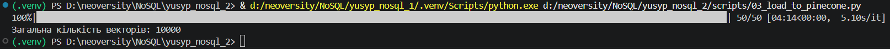

# Частина 1 — Підготовка даних і вибір інструментів

## 1.2. Вибір інструментів

### 1. Чим Pinecone відрізняється від Qdrant і Chroma за моделлю розгортання, ліцензією і продуктивністю? У якому сценарії ви б обрали кожен із них?
**Pinecone** розгортається тіки в хмарі, його не можливо запустити на своєму сервері. Це ліцезований комерційний продукт, відповідно вихідний код закритий. Має хорошу продуктивність.

**Qdrant** може бути розгонутим на власному сервері, або на хмарному сервісі, тобто гібридний формат. Перевага в тому що вихідний код відкритий, а також всі дачі, які можуть бути чутливими зберігаються на власному сервері за необхідності. Також має хорошу продуктивність.

**Chroma** розгортається максимально просто, встановлюється бібліотека і імпортується. Розміщується на локальному сервері, має відкритий вихідний код. По продуктивності не передбачена для роботи з великими обсягами даних.

### 2. Чому для задачі пошуку по науковим текстам обрана модель specter2_base, а не універсальна all-MiniLM-L6-v2? Знайдіть картку моделі на HuggingFace і процитуйте, для яких задач вона навчена.

`specter2_base` модель навчена на понад 6 мільйонах триплетах цитувань наукових статей, тому це набагато кращий варіант моделі для семантичоного пошуку по наукових статтях на відміну від універсальної `all-MiniLM-L6-v2`. Згідно з HuggingFace `specter2_base` передбачена для таких задач:
- класифікація (сортування за категоріями або галузю знань)
- Регресія (прогнозування майбутніх показників, наприклад кількості цитувань)
- Пошук схожого (документі за змістом які є найближчими один до одного)
- Adhoc-пошук (пошук за запитом)

### 3. Що написано у картці моделі про рекомендовану метрику схожості? Чому це важливо при створенні індексу?

Модель використуває різні метрики вимірювання, та в прикладах застосовують найчастіше косинусну схожість. При створенні індексу, косинусна схожість буде враховувати близкість векторів, а не їх довжину, тим самим нівелюючи розмір статті. Щодо конкретно рекомендованих метрик схожості які були б написані в катці моделі інформації я не знайшов.

## 1.3 Отримання ембеддингів

### Поясніть, чому при використанні нормалізованих ембеддингів (одиничної довжини) косинусна схожість (cosine similarity) еквівалентна скалярному добутку (dot product)?

Їхній еквівалент випливає з математичної сторони, фактично формула косинусної схожості це (dot product / довжини векторів). Таким чином при нормалізації цих довжин ми приводимо їх до одиничної форми. Відповідно якщо довжина одинична то це (dot product / 1), а відповідно приходимо до висновку, що якщо нормалізувати ембединги то косинусна схожіть = dot product, тобто скалярному добутку.

# Частина 2 — Завантаження даних і метадані



# Частина 3 — Пошукові запити

## Пояснення до пункту 4

Запит А не виві нічого тому що статей за останні 5 років нових не було, натомість більшість статей 2007 року.

### Чи збігаються топ-5 для cosine і dot product і чому?
Результати повністю збігаються, це тому що ми нормалізували довжини щоб при пошуку модель не опиралась на обсяг статті, а на її семантичний зміст.

### Чи відрізняються результати для L2 і чому?
Результати не відрізняються. Насправді цього разу ми просто не обертали список, а брали його дані такими як вони є, тому що при Евклідовій відстані ми отримуємо результати в порядку спадання. Фактично косинусна подібність та евклідова відстань також пов'язані формулою, за однієї відмінністю, чим більша косинусна схожість, тим менша Евклідова відстань, і навпаки.

### Що сталося б, якби ембеддинги не були нормалізовані?
- Косинусна схожість підбирала б статті лише за напрямком, тим самим даючи результати найкращі за семантичним змістом

- скалярний добуток надавав би перевагу більше статтям за обсягом, тобто якщо в одній статті повторюється частіше якесь слово ніж в іншій, вектор би роздувавася, тим самим ми отримували б більше великих за обсягом статей 

- Евклідова відстань чутлива до відстані векторів, тому якщо вектори близькі за семантичним змістом, але сильно відрізняються за обсягом, то будуть вважатись далекими один від одного

# Частина 4 — Chunking

```html
(.venv) PS D:\neoversity\NoSQL\yusyp_nosql_2> & d:/neoversity/NoSQL/yusyp_nosql_1/.venv/Scripts/python.exe d:/neoversity/NoSQL/yusyp_nosql_2/scripts/05_chunking.py
Warning: You are sending unauthenticated requests to the HF Hub. Please set a HF_TOKEN to enable higher rate limits and faster downloads.
Loading weights: 100%|█████████████████████████████████████████████████████████████████████████████████████████████████████████████████████| 199/199 [00:00<00:00, 37934.21it/s]
Batches: 100%|████████████████████████████████████████████████████████████████████████████████████████████████████████████████████████████████████| 1/1 [00:08<00:00,  8.89s/it]
Batches: 100%|████████████████████████████████████████████████████████████████████████████████████████████████████████████████████████████████████| 2/2 [00:12<00:00,  6.44s/it]
Завантаження в arxiv-chunks-fixed
100%|█████████████████████████████████████████████████████████████████████████████████████████████████████████████████████████████████████████████| 1/1 [00:01<00:00,  1.82s/it]
Batches: 100%|████████████████████████████████████████████████████████████████████████████████████████████████████████████████████████████████████| 1/1 [00:08<00:00,  8.41s/it]
Завантаження в arxiv-chunks-semantic
100%|█████████████████████████████████████████████████████████████████████████████████████████████████████████████████████████████████████████████| 1/1 [00:01<00:00,  1.66s/it]
Результати пошуку для: "How do transformer architectures improve zero-shot learning capabilities in large language models?" (Index: arxiv-chunks-fixed)
1. Заголовок: Improving Stellar and Planetary Parameters of Transiting Planet Systems:
  The Case of TrES-2
   Текст: $M_\star = 0.980\pm0.062 M_\odot$ and $R_\star = 1.000_{-0.033}^{+0.036} R_\odot$, and an evolutionary age of $5.1^{+2.7}_{-2.3}$ Gyr, in good agreement with other constraints based on the strength of...
   Score: 0.5609

2. Заголовок: Improving Stellar and Planetary Parameters of Transiting Planet Systems:
  The Case of TrES-2
   Текст: We report on a spectroscopic determination of the atmospheric parameters and chemical abundance of the parent star of the recently discovered transiting planet {TrES-2}. A detailed LTE analysis of a s...
   Score: 0.5463

Результати пошуку для: "How do transformer architectures improve zero-shot learning capabilities in large language models?" (Index: arxiv-chunks-semantic)
1. Заголовок: Improving Stellar and Planetary Parameters of Transiting Planet Systems:
  The Case of TrES-2
   Текст: We report on a spectroscopic determination of the atmospheric parameters and
chemical abundance of the parent star of the recently discovered transiting
planet {TrES-2}. A detailed LTE analysis of a s...
   Score: 0.5119

Результати пошуку для: "Techniques for mitigating catastrophic forgetting in continual learning networks." (Index: arxiv-chunks-fixed)
1. Заголовок: Improving Stellar and Planetary Parameters of Transiting Planet Systems:
  The Case of TrES-2
   Текст: $M_\star = 0.980\pm0.062 M_\odot$ and $R_\star = 1.000_{-0.033}^{+0.036} R_\odot$, and an evolutionary age of $5.1^{+2.7}_{-2.3}$ Gyr, in good agreement with other constraints based on the strength of...
   Score: 0.5353

2. Заголовок: Improving Stellar and Planetary Parameters of Transiting Planet Systems:
  The Case of TrES-2
   Текст: We report on a spectroscopic determination of the atmospheric parameters and chemical abundance of the parent star of the recently discovered transiting planet {TrES-2}. A detailed LTE analysis of a s...
   Score: 0.5217

Результати пошуку для: "Techniques for mitigating catastrophic forgetting in continual learning networks." (Index: arxiv-chunks-semantic)
1. Заголовок: Improving Stellar and Planetary Parameters of Transiting Planet Systems:
  The Case of TrES-2
   Текст: We report on a spectroscopic determination of the atmospheric parameters and
chemical abundance of the parent star of the recently discovered transiting
planet {TrES-2}. A detailed LTE analysis of a s...
   Score: 0.4861

Результати пошуку для: "What are the most robust optimization algorithms for training deep generative models?" (Index: arxiv-chunks-fixed)
1. Заголовок: Improving Stellar and Planetary Parameters of Transiting Planet Systems:
  The Case of TrES-2
   Текст: $M_\star = 0.980\pm0.062 M_\odot$ and $R_\star = 1.000_{-0.033}^{+0.036} R_\odot$, and an evolutionary age of $5.1^{+2.7}_{-2.3}$ Gyr, in good agreement with other constraints based on the strength of...
   Score: 0.5970

2. Заголовок: Improving Stellar and Planetary Parameters of Transiting Planet Systems:
  The Case of TrES-2
   Текст: We report on a spectroscopic determination of the atmospheric parameters and chemical abundance of the parent star of the recently discovered transiting planet {TrES-2}. A detailed LTE analysis of a s...
   Score: 0.5894

Результати пошуку для: "What are the most robust optimization algorithms for training deep generative models?" (Index: arxiv-chunks-semantic)
1. Заголовок: Improving Stellar and Planetary Parameters of Transiting Planet Systems:
  The Case of TrES-2
   Текст: We report on a spectroscopic determination of the atmospheric parameters and
chemical abundance of the parent star of the recently discovered transiting
planet {TrES-2}. A detailed LTE analysis of a s...
   Score: 0.5540

Результати пошуку для: "Addressing bias and fairness issues in natural language processing datasets." (Index: arxiv-chunks-fixed)
1. Заголовок: Improving Stellar and Planetary Parameters of Transiting Planet Systems:
  The Case of TrES-2
   Текст: We report on a spectroscopic determination of the atmospheric parameters and chemical abundance of the parent star of the recently discovered transiting planet {TrES-2}. A detailed LTE analysis of a s...
   Score: 0.5381

2. Заголовок: Improving Stellar and Planetary Parameters of Transiting Planet Systems:
  The Case of TrES-2
   Текст: $M_\star = 0.980\pm0.062 M_\odot$ and $R_\star = 1.000_{-0.033}^{+0.036} R_\odot$, and an evolutionary age of $5.1^{+2.7}_{-2.3}$ Gyr, in good agreement with other constraints based on the strength of...
   Score: 0.5368

Результати пошуку для: "Addressing bias and fairness issues in natural language processing datasets." (Index: arxiv-chunks-semantic)
1. Заголовок: Improving Stellar and Planetary Parameters of Transiting Planet Systems:
  The Case of TrES-2
   Текст: We report on a spectroscopic determination of the atmospheric parameters and
chemical abundance of the parent star of the recently discovered transiting
planet {TrES-2}. A detailed LTE analysis of a s...
   Score: 0.4989

Результати пошуку для: "Applications of graph theory and spectral clustering in complex network analysis." (Index: arxiv-chunks-fixed)
1. Заголовок: Improving Stellar and Planetary Parameters of Transiting Planet Systems:
  The Case of TrES-2
   Текст: We report on a spectroscopic determination of the atmospheric parameters and chemical abundance of the parent star of the recently discovered transiting planet {TrES-2}. A detailed LTE analysis of a s...
   Score: 0.5817

2. Заголовок: Improving Stellar and Planetary Parameters of Transiting Planet Systems:
  The Case of TrES-2
   Текст: $M_\star = 0.980\pm0.062 M_\odot$ and $R_\star = 1.000_{-0.033}^{+0.036} R_\odot$, and an evolutionary age of $5.1^{+2.7}_{-2.3}$ Gyr, in good agreement with other constraints based on the strength of...
   Score: 0.5600

Результати пошуку для: "Applications of graph theory and spectral clustering in complex network analysis." (Index: arxiv-chunks-semantic)
1. Заголовок: Improving Stellar and Planetary Parameters of Transiting Planet Systems:
  The Case of TrES-2
   Текст: We report on a spectroscopic determination of the atmospheric parameters and
chemical abundance of the parent star of the recently discovered transiting
planet {TrES-2}. A detailed LTE analysis of a s...
   Score: 0.5416

Результати пошуку для: "How is advanced linear algebra utilized in non-linear dimensionality reduction techniques like t-SNE or UMAP?" (Index: arxiv-chunks-fixed)
1. Заголовок: Improving Stellar and Planetary Parameters of Transiting Planet Systems:
  The Case of TrES-2
   Текст: $M_\star = 0.980\pm0.062 M_\odot$ and $R_\star = 1.000_{-0.033}^{+0.036} R_\odot$, and an evolutionary age of $5.1^{+2.7}_{-2.3}$ Gyr, in good agreement with other constraints based on the strength of...
   Score: 0.5814

2. Заголовок: Improving Stellar and Planetary Parameters of Transiting Planet Systems:
  The Case of TrES-2
   Текст: We report on a spectroscopic determination of the atmospheric parameters and chemical abundance of the parent star of the recently discovered transiting planet {TrES-2}. A detailed LTE analysis of a s...
   Score: 0.5676

Результати пошуку для: "How is advanced linear algebra utilized in non-linear dimensionality reduction techniques like t-SNE or UMAP?" (Index: arxiv-chunks-semantic)
1. Заголовок: Improving Stellar and Planetary Parameters of Transiting Planet Systems:
  The Case of TrES-2
   Текст: We report on a spectroscopic determination of the atmospheric parameters and
chemical abundance of the parent star of the recently discovered transiting
planet {TrES-2}. A detailed LTE analysis of a s...
   Score: 0.5284

Результати пошуку для: "Probabilistic frameworks for uncertainty estimation in Bayesian neural networks." (Index: arxiv-chunks-fixed)
1. Заголовок: Improving Stellar and Planetary Parameters of Transiting Planet Systems:
  The Case of TrES-2
   Текст: $M_\star = 0.980\pm0.062 M_\odot$ and $R_\star = 1.000_{-0.033}^{+0.036} R_\odot$, and an evolutionary age of $5.1^{+2.7}_{-2.3}$ Gyr, in good agreement with other constraints based on the strength of...
   Score: 0.5739

2. Заголовок: Improving Stellar and Planetary Parameters of Transiting Planet Systems:
  The Case of TrES-2
   Текст: We report on a spectroscopic determination of the atmospheric parameters and chemical abundance of the parent star of the recently discovered transiting planet {TrES-2}. A detailed LTE analysis of a s...
   Score: 0.5623

Результати пошуку для: "Probabilistic frameworks for uncertainty estimation in Bayesian neural networks." (Index: arxiv-chunks-semantic)
1. Заголовок: Improving Stellar and Planetary Parameters of Transiting Planet Systems:
  The Case of TrES-2
   Текст: We report on a spectroscopic determination of the atmospheric parameters and
chemical abundance of the parent star of the recently discovered transiting
planet {TrES-2}. A detailed LTE analysis of a s...
   Score: 0.5299

Результати пошуку для: "Convergence rates of stochastic gradient descent in non-convex optimization problems." (Index: arxiv-chunks-fixed)
1. Заголовок: Improving Stellar and Planetary Parameters of Transiting Planet Systems:
  The Case of TrES-2
   Текст: $M_\star = 0.980\pm0.062 M_\odot$ and $R_\star = 1.000_{-0.033}^{+0.036} R_\odot$, and an evolutionary age of $5.1^{+2.7}_{-2.3}$ Gyr, in good agreement with other constraints based on the strength of...
   Score: 0.5784

2. Заголовок: Improving Stellar and Planetary Parameters of Transiting Planet Systems:
  The Case of TrES-2
   Текст: We report on a spectroscopic determination of the atmospheric parameters and chemical abundance of the parent star of the recently discovered transiting planet {TrES-2}. A detailed LTE analysis of a s...
   Score: 0.5671

Результати пошуку для: "Convergence rates of stochastic gradient descent in non-convex optimization problems." (Index: arxiv-chunks-semantic)
1. Заголовок: Improving Stellar and Planetary Parameters of Transiting Planet Systems:
  The Case of TrES-2
   Текст: We report on a spectroscopic determination of the atmospheric parameters and
chemical abundance of the parent star of the recently discovered transiting
planet {TrES-2}. A detailed LTE analysis of a s...
   Score: 0.5296

Результати пошуку для: "Energy-efficient consensus mechanisms in distributed ledger systems." (Index: arxiv-chunks-fixed)
1. Заголовок: Improving Stellar and Planetary Parameters of Transiting Planet Systems:
  The Case of TrES-2
   Текст: $M_\star = 0.980\pm0.062 M_\odot$ and $R_\star = 1.000_{-0.033}^{+0.036} R_\odot$, and an evolutionary age of $5.1^{+2.7}_{-2.3}$ Gyr, in good agreement with other constraints based on the strength of...
   Score: 0.5601

2. Заголовок: Improving Stellar and Planetary Parameters of Transiting Planet Systems:
  The Case of TrES-2
   Текст: We report on a spectroscopic determination of the atmospheric parameters and chemical abundance of the parent star of the recently discovered transiting planet {TrES-2}. A detailed LTE analysis of a s...
   Score: 0.5394

Результати пошуку для: "Energy-efficient consensus mechanisms in distributed ledger systems." (Index: arxiv-chunks-semantic)
1. Заголовок: Improving Stellar and Planetary Parameters of Transiting Planet Systems:
  The Case of TrES-2
   Текст: We report on a spectroscopic determination of the atmospheric parameters and
chemical abundance of the parent star of the recently discovered transiting
planet {TrES-2}. A detailed LTE analysis of a s...
   Score: 0.5023

Результати пошуку для: "Recent advancements in error correction codes for quantum computing architectures." (Index: arxiv-chunks-fixed)
1. Заголовок: Improving Stellar and Planetary Parameters of Transiting Planet Systems:
  The Case of TrES-2
   Текст: $M_\star = 0.980\pm0.062 M_\odot$ and $R_\star = 1.000_{-0.033}^{+0.036} R_\odot$, and an evolutionary age of $5.1^{+2.7}_{-2.3}$ Gyr, in good agreement with other constraints based on the strength of...
   Score: 0.5874

2. Заголовок: Improving Stellar and Planetary Parameters of Transiting Planet Systems:
  The Case of TrES-2
   Текст: We report on a spectroscopic determination of the atmospheric parameters and chemical abundance of the parent star of the recently discovered transiting planet {TrES-2}. A detailed LTE analysis of a s...
   Score: 0.5812

Результати пошуку для: "Recent advancements in error correction codes for quantum computing architectures." (Index: arxiv-chunks-semantic)
1. Заголовок: Improving Stellar and Planetary Parameters of Transiting Planet Systems:
  The Case of TrES-2
   Текст: We report on a spectroscopic determination of the atmospheric parameters and
chemical abundance of the parent star of the recently discovered transiting
planet {TrES-2}. A detailed LTE analysis of a s...
   Score: 0.5431

Результати пошуку для: "Optimizing memory allocation and parallelism in high-performance GPU computing." (Index: arxiv-chunks-fixed)
1. Заголовок: Improving Stellar and Planetary Parameters of Transiting Planet Systems:
  The Case of TrES-2
   Текст: $M_\star = 0.980\pm0.062 M_\odot$ and $R_\star = 1.000_{-0.033}^{+0.036} R_\odot$, and an evolutionary age of $5.1^{+2.7}_{-2.3}$ Gyr, in good agreement with other constraints based on the strength of...
   Score: 0.5669

2. Заголовок: Improving Stellar and Planetary Parameters of Transiting Planet Systems:
  The Case of TrES-2
   Текст: We report on a spectroscopic determination of the atmospheric parameters and chemical abundance of the parent star of the recently discovered transiting planet {TrES-2}. A detailed LTE analysis of a s...
   Score: 0.5561

Результати пошуку для: "Optimizing memory allocation and parallelism in high-performance GPU computing." (Index: arxiv-chunks-semantic)
1. Заголовок: Improving Stellar and Planetary Parameters of Transiting Planet Systems:
  The Case of TrES-2
   Текст: We report on a spectroscopic determination of the atmospheric parameters and
chemical abundance of the parent star of the recently discovered transiting
planet {TrES-2}. A detailed LTE analysis of a s...
   Score: 0.5200

Результати пошуку для: "What methods are used to determine the atmospheric parameters and chemical abundances of parent stars in transiting planet systems?" (Index: arxiv-chunks-fixed)
1. Заголовок: Improving Stellar and Planetary Parameters of Transiting Planet Systems:
  The Case of TrES-2
   Текст: We report on a spectroscopic determination of the atmospheric parameters and chemical abundance of the parent star of the recently discovered transiting planet {TrES-2}. A detailed LTE analysis of a s...
   Score: 0.7255

2. Заголовок: Improving Stellar and Planetary Parameters of Transiting Planet Systems:
  The Case of TrES-2
   Текст: $M_\star = 0.980\pm0.062 M_\odot$ and $R_\star = 1.000_{-0.033}^{+0.036} R_\odot$, and an evolutionary age of $5.1^{+2.7}_{-2.3}$ Gyr, in good agreement with other constraints based on the strength of...
   Score: 0.6665

Результати пошуку для: "What methods are used to determine the atmospheric parameters and chemical abundances of parent stars in transiting planet systems?" (Index: arxiv-chunks-semantic)
1. Заголовок: Improving Stellar and Planetary Parameters of Transiting Planet Systems:
  The Case of TrES-2
   Текст: We report on a spectroscopic determination of the atmospheric parameters and
chemical abundance of the parent star of the recently discovered transiting
planet {TrES-2}. A detailed LTE analysis of a s...
   Score: 0.6780

Результати пошуку для: "How do the mass, radius, and evolutionary age of a parent star constrain the parameters of its transiting exoplanet?" (Index: arxiv-chunks-fixed)
1. Заголовок: Improving Stellar and Planetary Parameters of Transiting Planet Systems:
  The Case of TrES-2
   Текст: We report on a spectroscopic determination of the atmospheric parameters and chemical abundance of the parent star of the recently discovered transiting planet {TrES-2}. A detailed LTE analysis of a s...
   Score: 0.7487

2. Заголовок: Improving Stellar and Planetary Parameters of Transiting Planet Systems:
  The Case of TrES-2
   Текст: $M_\star = 0.980\pm0.062 M_\odot$ and $R_\star = 1.000_{-0.033}^{+0.036} R_\odot$, and an evolutionary age of $5.1^{+2.7}_{-2.3}$ Gyr, in good agreement with other constraints based on the strength of...
   Score: 0.6928

Результати пошуку для: "How do the mass, radius, and evolutionary age of a parent star constrain the parameters of its transiting exoplanet?" (Index: arxiv-chunks-semantic)
1. Заголовок: Improving Stellar and Planetary Parameters of Transiting Planet Systems:
  The Case of TrES-2
   Текст: We report on a spectroscopic determination of the atmospheric parameters and
chemical abundance of the parent star of the recently discovered transiting
planet {TrES-2}. A detailed LTE analysis of a s...
   Score: 0.7107

Результати пошуку для: "Applications of detailed Local Thermodynamic Equilibrium (LTE) analysis in stellar spectroscopy." (Index: arxiv-chunks-fixed)
1. Заголовок: Improving Stellar and Planetary Parameters of Transiting Planet Systems:
  The Case of TrES-2
   Текст: We report on a spectroscopic determination of the atmospheric parameters and chemical abundance of the parent star of the recently discovered transiting planet {TrES-2}. A detailed LTE analysis of a s...
   Score: 0.6481

2. Заголовок: Improving Stellar and Planetary Parameters of Transiting Planet Systems:
  The Case of TrES-2
   Текст: $M_\star = 0.980\pm0.062 M_\odot$ and $R_\star = 1.000_{-0.033}^{+0.036} R_\odot$, and an evolutionary age of $5.1^{+2.7}_{-2.3}$ Gyr, in good agreement with other constraints based on the strength of...
   Score: 0.6135

Результати пошуку для: "Applications of detailed Local Thermodynamic Equilibrium (LTE) analysis in stellar spectroscopy." (Index: arxiv-chunks-semantic)
1. Заголовок: Improving Stellar and Planetary Parameters of Transiting Planet Systems:
  The Case of TrES-2
   Текст: We report on a spectroscopic determination of the atmospheric parameters and
chemical abundance of the parent star of the recently discovered transiting
planet {TrES-2}. A detailed LTE analysis of a s...
   Score: 0.6000

Результати пошуку для: "How do astronomers improve the accuracy of stellar and planetary parameters for recently discovered transiting systems like TrES-2?" (Index: arxiv-chunks-fixed)
1. Заголовок: Improving Stellar and Planetary Parameters of Transiting Planet Systems:
  The Case of TrES-2
   Текст: We report on a spectroscopic determination of the atmospheric parameters and chemical abundance of the parent star of the recently discovered transiting planet {TrES-2}. A detailed LTE analysis of a s...
   Score: 0.6999

2. Заголовок: Improving Stellar and Planetary Parameters of Transiting Planet Systems:
  The Case of TrES-2
   Текст: $M_\star = 0.980\pm0.062 M_\odot$ and $R_\star = 1.000_{-0.033}^{+0.036} R_\odot$, and an evolutionary age of $5.1^{+2.7}_{-2.3}$ Gyr, in good agreement with other constraints based on the strength of...
   Score: 0.6699

Результати пошуку для: "How do astronomers improve the accuracy of stellar and planetary parameters for recently discovered transiting systems like TrES-2?" (Index: arxiv-chunks-semantic)
1. Заголовок: Improving Stellar and Planetary Parameters of Transiting Planet Systems:
  The Case of TrES-2
   Текст: We report on a spectroscopic determination of the atmospheric parameters and
chemical abundance of the parent star of the recently discovered transiting
planet {TrES-2}. A detailed LTE analysis of a s...
   Score: 0.6545
```

### Яка стратегія дає більш осмислені чанки?
Більш осмислені чанки дає однозначно семантичний підхід, та варто зауважити що коли ми відібрали для цього завдання найдовші статті, вони всі переважно стосуються астрофізики, а не наших запитів які стосуються комп'ютерних наук. Я залишив запити без змін, тому що так навіть цікавіше для оцінки отриманих результатів.

### Чи є випадки розрізаних речень і як це впливає на ембеддинги?
Випадки розрізаних речень є, це робота фіксованого підходу. Через те що чанки поділені суто по кількості слів, без врахування контексту, такий підхід видає нам формули, чи обрізані шматки тексту які подекуди не несуть жодної суті

### Як розмір overlap впливає на кількість чанків і покриття тексту?
Чим більший overlap тим менший крок. Чим менший крок тим більше чанків. Чим більше чанків тим більше кількість векторів у бд. Відповідно, зміст зберігається краще, але витрати на швидкодію та інфрастуктуру більші.