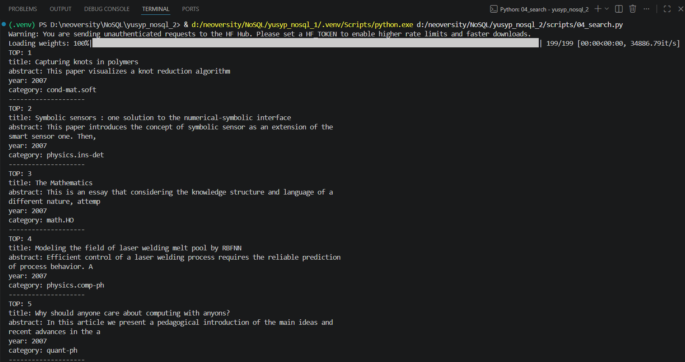
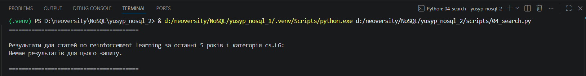
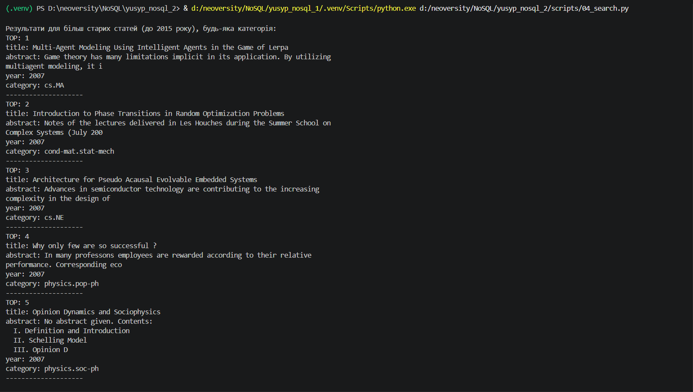
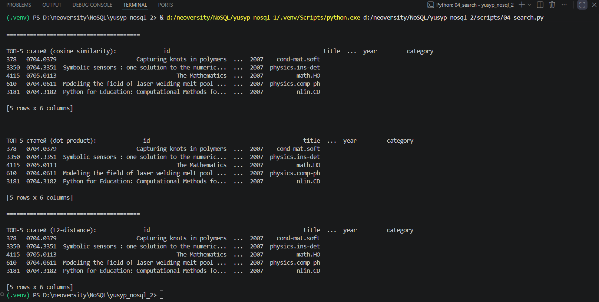

# Частина 1 — Підготовка даних і вибір інструментів

## 1.2. Вибір інструментів

### 1. Чим Pinecone відрізняється від Qdrant і Chroma за моделлю розгортання, ліцензією і продуктивністю? У якому сценарії ви б обрали кожен із них?
**Pinecone** розгортається тіки в хмарі, його не можливо запустити на своєму сервері. Це ліцезований комерційний продукт, відповідно вихідний код закритий. Має хорошу продуктивність.

**Qdrant** може бути розгонутим на власному сервері, або на хмарному сервісі, тобто гібридний формат. Перевага в тому що вихідний код відкритий, а також всі дачі, які можуть бути чутливими зберігаються на власному сервері за необхідності. Також має хорошу продуктивність.

**Chroma** розгортається максимально просто, встановлюється бібліотека і імпортується. Розміщується на локальному сервері, має відкритий вихідний код. По продуктивності не передбачена для роботи з великими обсягами даних.

### 2. Чому для задачі пошуку по науковим текстам обрана модель specter2_base, а не універсальна all-MiniLM-L6-v2? Знайдіть картку моделі на HuggingFace і процитуйте, для яких задач вона навчена.

`specter2_base` модель навчена на понад 6 мільйонах триплетах цитувань наукових статей, тому це набагато кращий варіант моделі для семантичоного пошуку по наукових статтях на відміну від універсальної `all-MiniLM-L6-v2`. Згідно з HuggingFace `specter2_base` передбачена для таких задач:
- класифікація (сортування за категоріями або галузю знань)
- Регресія (прогнозування майбутніх показників, наприклад кількості цитувань)
- Пошук схожого (документі за змістом які є найближчими один до одного)
- Adhoc-пошук (пошук за запитом)

### 3. Що написано у картці моделі про рекомендовану метрику схожості? Чому це важливо при створенні індексу?

Модель використуває різні метрики вимірювання, та в прикладах застосовують найчастіше косинусну схожість. При створенні індексу, косинусна схожість буде враховувати близкість векторів, а не їх довжину, тим самим нівелюючи розмір статті. Щодо конкретно рекомендованих метрик схожості які були б написані в катці моделі інформації я не знайшов.

## 1.3 Отримання ембеддингів

### Поясніть, чому при використанні нормалізованих ембеддингів (одиничної довжини) косинусна схожість (cosine similarity) еквівалентна скалярному добутку (dot product)?

Їхній еквівалент випливає з математичної сторони, фактично формула косинусної схожості це (dot product / довжини векторів). Таким чином при нормалізації цих довжин ми приводимо їх до одиничної форми. Відповідно якщо довжина одинична то це (dot product / 1), а відповідно приходимо до висновку, що якщо нормалізувати ембединги то косинусна схожіть = dot product, тобто скалярному добутку.

# Частина 2 — Завантаження даних і метадані

# Частина 3 — Пошукові запити

## Пояснення до пункту 4

Запит А не вивів нічого тому що статей за останні 5 років нових не було, натомість більшість статей 2007 року.

## Скріншоти решти виводів

### Чи збігаються топ-5 для cosine і dot product і чому?
Результати повністю збігаються, це тому що ми нормалізували довжини щоб при пошуку модель не опиралась на обсяг статті, а на її семантичний зміст.

### Чи відрізняються результати для L2 і чому?
Результати не відрізняються. Насправді цього разу ми просто не обертали список, а брали його дані такими як вони є, тому що при Евклідовій відстані ми отримуємо результати в порядку спадання. Фактично косинусна подібність та евклідова відстань також пов'язані формулою, за однієї відмінністю, чим більша косинусна схожість, тим менша Евклідова відстань, і навпаки.

### Що сталося б, якби ембеддинги не були нормалізовані?
- Косинусна схожість підбирала б статті лише за напрямком, тим самим даючи результати найкращі за семантичним змістом

- скалярний добуток надавав би перевагу більше статтям за обсягом, тобто якщо в одній статті повторюється частіше якесь слово ніж в іншій, вектор би роздувавася, тим самим ми отримували б більше великих за обсягом статей 

- Евклідова відстань чутлива до відстані векторів, тому якщо вектори близькі за семантичним змістом, але сильно відрізняються за обсягом, то будуть вважатись далекими один від одного